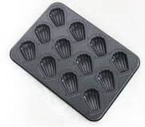
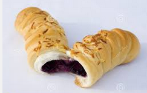

Oven
====

 + 
<br><br>

Implement interfaces at the RUNTIME.

Better points than `dynamic` keyword
----
* Strict type and name checking
* BUT, dynamic linking between interface and implementation

How to Bake
----
Prepare a `Bakeware`
```c#
public interface Math
{
  int Sum(int a,int b);
}
```
Make `Fillings`
```c#
public class MathImpl
{
  public object OnMethod(Type type, MethodInfo method, object[] args)
  {
    if(method.Name == nameof(Bread.Sum))
      return (int)args[0] + (int)args[1];
    else
      throw new NotImplementedException();
  }
}
```
Time to bake now
```c#
var bread = Oven.Bake<Math, MathImpl>();

Console.WriteLine(bread.Sum(1, 2));
```